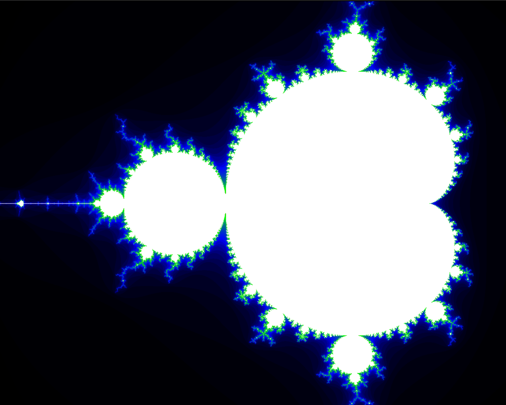
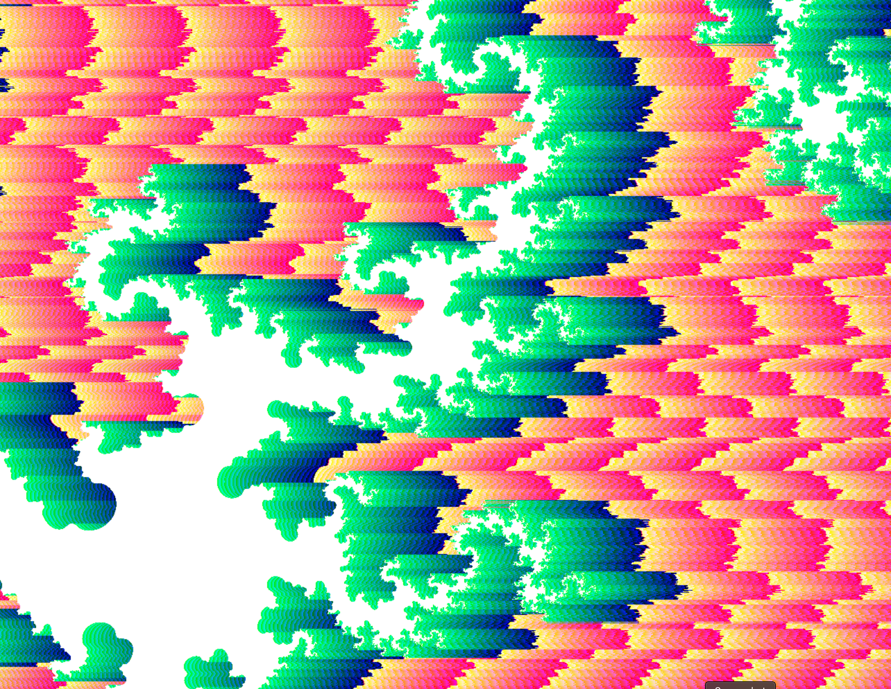

# fract_ol
Hive fractal explorer project.

~~This project needs the mlx library provided by the school to compile. It is used to open a window, color pixels in the window and get input from mouse and keyboard.~~
Refactored for SDL2: ```brew install sdl2``` and ```make```

Move by clicking and dragging with mouse and zoom using bracket keys.
Iterations can be increased and decresed with minus and equals keys.
Colors can be changed with comma and period keys. (broken after sdl2 refactor)

examples:






